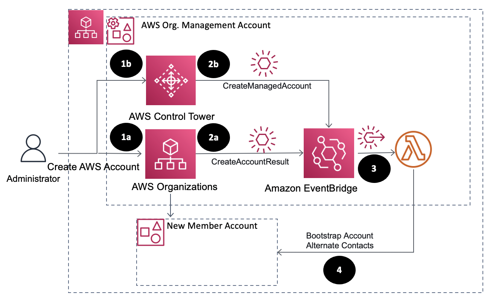

# Auto update Account Alternate Contacts for Newly created AWS Accounts


## About
This project contains source code and supporting files for a serverless pipeline for automatically updated alternate contacts fora newly created AWS Accounts that you can deploy with the SAM CLI. It includes the following files and folders.

- account_conctact_bootstrap - Code for the application's Lambda functions.
- aws-account-contact-bootstrap-template.yaml - A template that defines the application's AWS resources.

The application uses several AWS resources, including AWS Lambda function and Amazon EventBridge Rules. These resources are defined in the `aws-account-contact-bootstrap-template.yaml` file in this project. 


## Solution Architecture



## Building and Deploying the application

### Requirements

* AWS CLI - Installed and Configured with a valid profile [Install the AWS CLI](https://docs.aws.amazon.com/cli/latest/userguide/cli-chap-install.html)
* SAM CLI - [Install the SAM CLI](https://docs.aws.amazon.com/serverless-application-model/latest/developerguide/serverless-sam-cli-install.html)
* [Python 3 installed](https://www.python.org/downloads/)
* The Bash shell. For Linux and macOS, this is included by default. In Windows 10, you can install the [Windows Subsystem for Linux](https://docs.microsoft.com/en-us/windows/wsl/install-win10) to get a Windows-integrated version of Ubuntu and Bash.

### Setup
Download or clone this repository.

    $ git clone git@github.com:aws-samples/aws-account-contact-bootstrap.git
    $ cd aws-account-contact-bootstrap

Update the AWS CLI profile to be used in the `profile.txt` file.
    Note: even for `default` profile  ,Create a file with text `default` in the `profile.txt` file

To create a new bucket for deployment artifacts, run `create-bucket.sh` by specifying the region as arguement as shown below.

    $ ./create-bucket.sh us-east-1
    make_bucket: lambda-artifacts-a5e491dbb5b22e0d

### Deploy

To deploy the application, run `deploy.sh us-east-1`.

    $ ./deploy.sh
    BUILD SUCCESSFUL in 1s
    Successfully packaged artifacts and wrote output template to file out.yml.
    Waiting for changeset to be created..
    Successfully created/updated stack - aws-account-contact-bootstrap

This script uses AWS CloudFormation to deploy the Lambda functions and an IAM role. If the AWS CloudFormation stack that contains the resources already exists, the script updates it with any changes to the template or function code.


### Cleanup

To delete the sample application that you created, use the AWS CLI. Assuming you used your project name for the stack name, you can run the following:

```bash
aws cloudformation delete-stack --stack-name aws-account-contact-bootstrap
```
Or use the `cleanup.sh` script with deployment region as input

```
 $ ./cleanup.sh us-east-1
``` 

## License

This solution is licensed under the MIT-0 License. See the LICENSE file.


